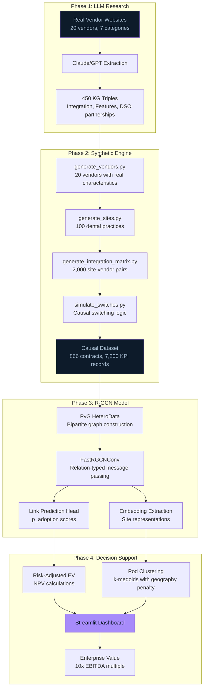

# Architecture

## System Overview



---

## Data Flow Diagram


---

## Component Details

### Phase 1: LLM-Based Vendor Research

**Purpose**: Ground synthetic data in real-world vendor characteristics.

| Model | Use Case | Batches |
|-------|----------|---------|
| Claude Opus | Primary research | Lab vendors, Scheduling |
| Claude Sonnet | Secondary research | RCM, Supplies |
| ChatGPT Pro | Validation | Telephony |

**Output**: Structured vendor profiles with:
- EHR integration capabilities (Dentrix, OpenDental, Eaglesoft, etc.)
- Integration type classification (full_api / partial_csv / none)
- DSO partnerships (Heartland, Smile Brands, etc.)
- Geographic coverage

### Phase 2: Causal Synthetic Data Engine

**Location**: `src/generators/`

```
generate_all_data.py          # Master pipeline
├── generate_sites.py         # 100 dental practices
├── generate_vendors.py       # 20 vendors, 7 categories
├── generate_integration_matrix.py  # Site-vendor integration quality
├── generate_initial_state.py # 2019 baseline contracts
├── simulate_switches.py      # Causal switching simulation
└── generate_kpis.py          # Days A/R, Denial Rate time series
```

**Key Causal Mechanism**:
```python
P_switch = base_monthly × integration_multiplier × fatigue_multiplier

# Integration multiplier
integration_multiplier = {
    0: 2.0,   # Manual entry → high friction → more likely to switch
    1: 1.3,   # CSV workflow → moderate friction
    2: 0.7    # Full API → sticky → less likely to switch
}

# Fatigue multiplier
fatigue_multiplier = {
    '<12 months': 0.3,   # Recently switched → exhausted
    '12-24 months': 0.7, # Hesitant
    '>24 months': 1.0    # Ready for change
}
```

### Phase 3: R-GCN Architecture

**Graph Structure**:
- **Node Types**: Sites (100), Vendors (20)
- **Edge Types**: `contracted_to` with 3 relation types (integration quality 0/1/2)

**Model Configuration**:
```python
FastRGCNConv(
    in_channels=site_features,
    out_channels=64,
    num_relations=3,  # Integration quality levels
    num_bases=3
)
```

**Training**:
- Temporal split: Train 2019-2022, Validate 2023-2024
- Loss: Binary cross-entropy + Risk MAE (alpha-weighted)
- Calibration: Isotonic regression post-hoc

### Phase 4: Decision Dashboard

**Location**: `app/app.py`

**Three Tabs**:
1. **Value Creation Summary**: J-curve, enterprise value metrics
2. **Synergy Discovery Radar**: Pod-level recommendations with filters
3. **Implementation Timeline**: Quarterly execution plan

**Financial Calculations**:
```python
# Risk-adjusted expected value
ev_risk_adj = p_adoption × gross_annual_value × risk_factor

# 3-Year NPV
npv_3y = (ev_risk_adj × ANNUITY_FACTOR_3Y) - impl_cost

# Enterprise value (PE standard)
enterprise_value = annual_ebitda × 10
```

---

## Data Schema

### Sites (`data/sites.csv`)
| Column | Type | Description |
|--------|------|-------------|
| site_id | string | S001-S100 |
| region | string | Northeast, South, West, Midwest |
| ehr_system | string | Dentrix, OpenDental, Eaglesoft, etc. |
| annual_revenue | float | $800K-$5M |

### Vendors (`data/vendors.csv`)
| Column | Type | Description |
|--------|------|-------------|
| vendor_id | string | V001-V020 |
| name | string | Real vendor names |
| category | string | Lab, RCM, Telephony, etc. |
| tier | int | 1 (budget), 2 (standard), 3 (premium) |

### Integration Matrix (`data/integration_matrix.csv`)
| Column | Type | Description |
|--------|------|-------------|
| site_id | string | Foreign key |
| vendor_id | string | Foreign key |
| integration_quality | int | 0 (none), 1 (partial), 2 (full_api) |

### Contracts (`data/contracts_2019_2024.csv`)
| Column | Type | Description |
|--------|------|-------------|
| contract_id | string | Unique ID |
| site_id | string | Foreign key |
| vendor_id | string | Foreign key |
| contract_start_date | date | Start |
| contract_end_date | date | End (null if active) |

---

## Reproducibility

All data generation is deterministic with seed control:

```bash
cd src/generators
python generate_all_data.py --seed 42 --n_sites 100
```

---

## References

- R-GCN Paper: [arXiv:1703.06103](https://arxiv.org/abs/1703.06103)
- PyTorch Geometric: [Documentation](https://pytorch-geometric.readthedocs.io/)
- Full methodology: [docs/methodology.md](docs/methodology.md)
